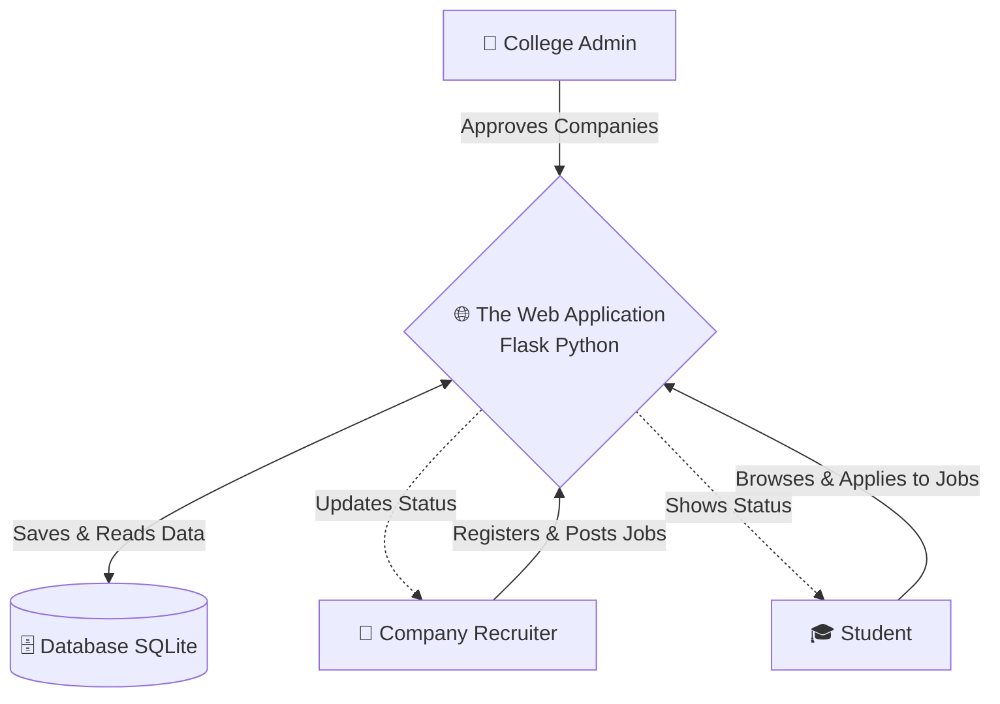

# 🚀 Campus Placement Portal - Complete Project Overview

Welcome to the **Campus Placement Portal**! I'm thrilled to walk you through this project. Whether you're a non-technical founder or a beginner developer, this guide will explain everything from scratch in plain English. 

---

## 🎯 What is this Project?

Imagine a physical college placement cell. 
- **Companies** arrive on campus wanting to hire students, but they need to be verified by the college first.
- **Students** want to see what jobs are available, hand in their resumes (apply), and track if they got selected.
- The **College Admin** oversees everything to make sure no fake companies pretend to be recruiters and that the process is smooth.

**This app is the digital version of that physical placement cell!** It connects Students and Companies on a single online platform, completely managed by an Admin.

---

## 🏗️ Architecture Diagram

Here is a visual map of how everything connects. (Don't worry, it's very straightforward!)

---

## 🔄 The Natural Workflow (A Real-Life Example)

Let's look at how our platform actually works from start to finish.

> [!TIP]
> This flow ensures that only verified companies can interact with students, creating a safe and reliable portal.

### Step 1: The Company Knocks on the Door 🏢
* **What Happens:** A company named "TechCorp" visits the website and signs up as a Company (`/register/company`).
* **The Catch:** They can't post jobs instantly! They are put in a "Waiting Room" (Pending Status).

### Step 2: The Admin Checks the ID 👔
* **What Happens:** The College Admin logs in with their master credentials (`admin` / `admin123`).
* **Action:** The Admin sees "TechCorp" waiting, verifies they are real, and clicks **Approve**. Now TechCorp has full access!

### Step 3: TechCorp Posts a Job 📝
* **What Happens:** TechCorp logs in and posts a job opening: *"Software Engineer Trainee"*.

### Step 4: A Student Looks for a Job 🎓
* **What Happens:** "Rahul", a student, creates an account (`/register/student`).
* **Action:** Rahul logs in, browses the open jobs, sees the "Software Engineer Trainee" role, and clicks **Apply**.

### Step 5: The Final Decision 🤝
* **What Happens:** TechCorp checks their dashboard and sees Rahul applied. They interview him offline, and then go back to the portal to update his application status to **"Accepted"** or **"Rejected"**. Rahul sees this outcome instantly on his own screen.

---

## ✨ Core Features Split by User

This app is beautifully divided so each person only sees what they are meant to see.

### 1. 👔 Admin (The Boss)
- **Login:** Unique dashboard URL just for them (`/admin/dashboard`).
- **Power:** The only person authorized to approve or reject new Company registrations. The system is auto-configured with an admin account on the first run.

### 2. 🏢 Company (The Employer)
- **Needs Approval:** Cannot do anything until the Admin approves them.
- **Job Management:** Can create new job postings after approval.
- **Applicant Tracking:** Receives student applications and can change their status.

### 3. 🎓 Student (The Job Seeker)
- **Open Access:** Can register immediately without needing Admin approval.
- **Job Hunting:** Can scroll through all available jobs.
- **Application:** Can apply for jobs and track whether they’ve been accepted or rejected.

---

## 🛠️ How It Was Built (The Tech in Simple Terms)

Even though you aren't writing the code, here is a simple breakdown of the ingredients we used to bake this cake:

1. **Python & Flask (The Brain & Plumbing):** This is the engine of the website. It takes a Student's click, talks to the database, and decides what page to show next. 
2. **SQLite (The File Cabinet):** Our database (`placement.db`). This is simply a secure digital notebook that remembers everyone's passwords, jobs, and applications forever. It is automatically created on the first run.
3. **HTML Templates (The Paint & Decor):** These files (`index.html`, `dashboard.html`) are what the user actually sees. They define where the buttons go and how text looks.
4. **WTForms & Flask-Login (The Security Guards):** These tools ensure people can't enter bad data into forms, and keep users safely logged in as they move from page to page.

---

## 📂 Understanding the Files in the Project

Here is a breakdown of what every file does in your folder:

* **`app.py`** -> **The Traffic Cop:** Every time a user clicks something, it goes here. `app.py` says "Oh, you are an Admin? Let me take you to the Admin Dashboard." It handles all the URLs, logins, and main logic.
* **`models.py`** -> **The Blueprint:** This defines what a "User" or a "Job" looks like. For example, it tells the database that every "Student" must have an ID, Name, Email, and Password. 
* **`config.py`** -> **The Settings Manual:** Holds basic settings like secret keys and database setup (like configuring your phone's system settings).
* **`requirements.txt`** -> **The Shopping List:** Tells the computer exactly what third-party tools to download to make the app run.
* **`templates/` folder** -> **The TV Screens:** Contains all the visual pages (Admin Dashboard, Login forms, etc.) that get sent to the user's browser.
* **`instance/placement.db`** -> **The Vault:** The actual database file where all live data is written.

---

## 🏁 How to Start It Up

1. Open your terminal in the project folder (`d:\Muthu\App Dev\`).
2. Activate your "Virtual Environment" (a sandbox for the app's tools) by typing: `.\venv\Scripts\Activate.ps1`.
3. Install tools if you haven't: `pip install -r requirements.txt`.
4. Turn on the engine: `python app.py`.
5. Open your web browser and go to: `http://localhost:5000`.

*You are now officially up and running!* 🚀
